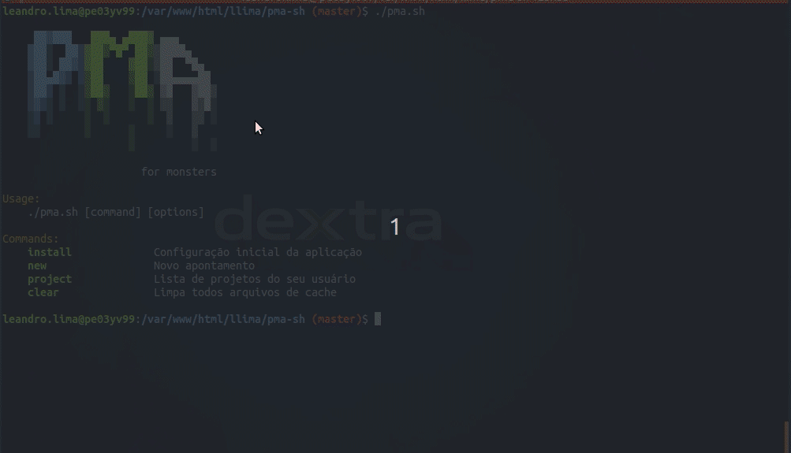
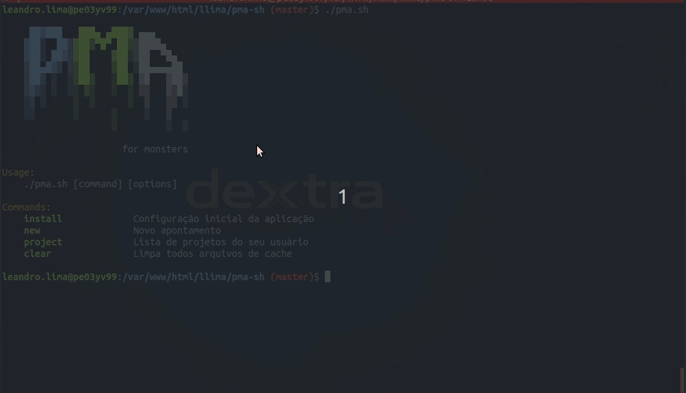

# PMA (for monsters)

Para quem vive no terminal e não quer sair para fazer aponamento.

## Configuração

Antes de utilizar copie o arquivo `scripts/configs.bash.example` para `scripts/configs.bash`.

Agora execute o comando `./pma.sh install` para realizar as configurações de login e selecionar projeto e descrição padrão.

## Apontamento

Para realizar um novo apontamento de horas, execute o comando abaixo:

`./pma.sh new <hr_start> <hr_end> <date :optional>`

#### Examplo 1 (data atual):
Apontamento para data atual:

`./pma.sh new 08:00 12:00`

#### Exemplo 2 (data personalizada):
Apontamento para data personalizada:
`./pma.sh new 08:00 12:00 29/01/2020`

## Projetos

Para listar projetos do seu usuário:

`./pma.sh project list`

Para listar atividades de um projeto, utilize o código retornado na lista `./pma.sh project list`:

`./pma.sh project items <project_cod>`

Para atualizar lista de projetos:

`./pma.sh project refresh`

